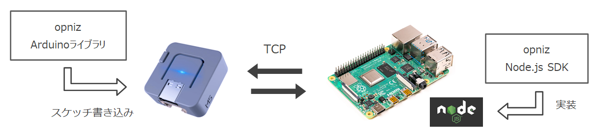

# opniz

`❗ このプロジェクトは現在アルファ版です。`

opnizとはM5StackといったESP32デバイスをNode.jsからobnizライクに制御するための、**Node.js SDK**および**Arduinoライブラリ**です。  
ざっくり言うとサーバーを介さない、オープンソースな、obnizっぽい実装ができるなにかです。  

仕組みとしてはESP32デバイスおよびNode.js SDKにて**TCPサーバー/クライアントを実行**し、相互にTCP経由で**JSONメッセージ**をやりとりしています。  

現在Node.js SDK、Arduinoライブラリともに**ESP32-PICO**および**M5ATOM Lite**クラスを実装しています。  
M5ATOM Liteクラスで**M5Stack、M5StickC、M5ATOM Matrixでの動作も確認しています。**  

新たなデバイスクラスを簡単に拡張できる設計となっています。  
おってリファレンスも作成予定ですが、クラス拡張ハンズオンも作成予定です。  

## Node.js SDK

アルファ版をGitHubにて公開しています。  

**[opniz-sdk-nodejs](https://github.com/miso-develop/opniz-sdk-nodejs)**

デバイスのRead/Writeを実行したり（Pinも動的に指定可能です）、デバイス側からのイベント（例えばM5Stack系デバイスのボタン等）を受け取って非同期に処理を実行したりできます。  

## Arduinoライブラリ

アルファ版をGitHubにて公開しています。  

**[opniz-device](https://github.com/miso-develop/opniz-device)**

Node.js SDKからのTCPリクエストを処理するハンドラーと、ESP32デバイスからのイベントを発火するエミッターを実装したデバイスクラスを提供します。  
Arduino IDEおよびPlatformIOに対応しています。  

## 実装状況

現在ESP32-PICO、M5ATOM Liteクラスを実装しています。  
これらのクラスを継承して簡単に新たなデバイスクラスを拡張できる設計となっています。  

ESP32-PICOクラスを継承したM5ATOM Liteクラスの実装を参照すると拡張のヒントになると思います。  

[Node.js SDKのM5ATOM Liteクラス](https://github.com/miso-develop/opniz-sdk-nodejs/blob/main/src/devices/M5AtomLite.ts)では、LEDを制御する`drawpix`メソッドと、デバイスのボタンを押したときの`onbutton`メソッドのふたつのメソッドのみを実装しています。  
このふたつのメソッドはそれぞれ、opnizデバイスに対する命令と、opnizデバイスからのイベント処理の実装です。  
opnizの拡張はこの2種類の動作を定義していくだけです。  

[ArduinoライブラリのM5ATOM Liteクラス](https://github.com/miso-develop/opniz-device/blob/main/src/devices/M5AtomLite.cpp)では、Node.js SDKからのLED制御メッセージを受け取る`DrawpixHandler`と、デバイスのボタンを押したときにNode.js SDKへイベントを発火する`ButtonEmitter`のみを実装しています。  
必要に応じて同様にハンドラー、エミッターを継承実装することで拡張が行えます。  

## ライセンス

[MIT](./LICENSE)
